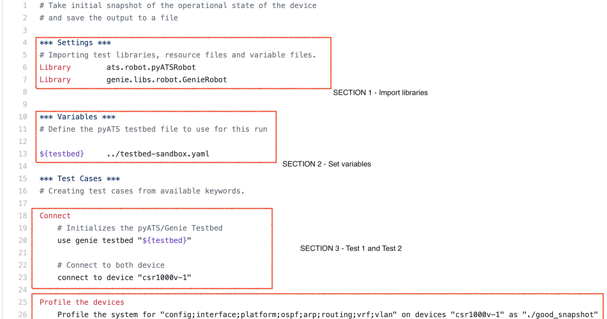

*This lab is part of a series of guides from the [Network Automation and Tooling workshop series](https://github.com/sttrayno/Network-Automation-Tooling)*

# Network test and validation with pyATS 

Network testing and validation tools is a massively growing area within network and infrastructure engineering. When you look at the growing interest in network automation and the move towards NetDevOps and CICD pipelines for the network, the need for tools that can carry out test and validation of the network is extremely important to validate that the change has actually gone through and hasn't impacted the network. pyATS looks to answer questions such as:

- What has changed on the network config?
- Is my data plane operating the way that I would expect?
- Can I compare my configuration and operational state against a known good baseline?
- Can I automate this test process across my entire estate?

Originally developed for internal Cisco engineering use , pyATS/Genie is at the core of Cisco's Test Automation Solution. Some interesting numbers on pyATS current use within Cisco:

- Used by 3000+ internal Cisco developers
- Over 2,000,000 test runs on a monthly basis
 


Before we get hands on there are a couple of core concepts that we need to explain as you might have noticed we've been using pyATS and Genie almost interchangeably, we need to explain pyATS and the different components a bit more.

### pyATS

pyATS is the core test framework foundation for this ecosystem. It specializes in data-driven and reusable testing, and is engineered for Agile, rapid development iterations.

This powerful, highly-pluggable Python framework is designed to enable developers start with small, simple and linear test cases, then scale towards large, complex and asynchronous test suites. The best way to think about pyATS is that it is the part which allows us to write our tests and we use that to build the logic in Python whetehr it has passed or failed.

### Genie

Genie and it's compoents how network engineers perform testing and scripting. It comes out of the box with all the bits needed for Network Test Automation, meaning that network engineers and NetDevOps can be productive day one with Genie's readily available and model-driven libraries. Genie has components such as parsers and other methods which allow us to work with networking devices and build our tests around it.

Genie builds on pyATS to provide:

- a simple command line interface (no Python knowledge needed)
- a pool of reusable test cases
- a Pythonic library for more complex scripting

For this lab we'll start using with using Genie and getting comfortable then move onto the flexibility that the pyATS framework offers.

pyATS / Genie is built from the ground up to be an agnostic infrastructure. All OS/Platform and management protocol support is defined and injected through plugins, library implementations & extensions.
Out of the box, it comes with libraries that support:

- Cisco IOS
- Cisco IOXE
- Cisco IOSXR
- Cisco NXOS
- Cisco ASA

... etc
and allows the device connections via CLI, NETCONF, or RESTCONF.
Additional support for 3rd-party platforms and other management protocols can be easily achieved through plugins and library extensions.

As you go deeper and deeper into pyATS and Genie you'll start to realise how many scenarios it could be applied to. If you'd like to go further than this guide please see the DevNet webpage on pyATS which is a fantastic resource and should be anyone who's trying to get hands on first port of call. https://developer.cisco.com/docs/pyats/#!pyats-genie-on-devnet/pyats-genie-on-devnet

## Exercise 0 - Installing pyATS and Genie

First thing to do is to make sure your system has a supported version of Python for pyATS, you can find out your installed version by running the `python --version`

Current versions of Python with support for pyATS on Linux & MacOS systems. Windows platforms are currently not supported, however is supported on Windows 10 with WSL:

- Python 3.5.x
- Python 3.6.x
- Python 3.7.x
- Python 3.8.x

Installing the pyATS library couldn't be simpler, all you need to do is run the command `pip install pyats[full]` which should carry out the needed installation process.

Verify the installation:

```bash
pip list | grep pyats
```

```bash
pip list | grep genie
```

When running pyATS it is strongly recommended that it is done so from a virtual environment. A Virtual Environment acts as isolated working copy of Python which allows you to work on a specific project without worry of affecting other projects. While you can run pyATS outside a virtual environment, it is strongly recommended that you use this as it creates an isolated environment for our exercise and allows us to create it's can have its own dependencies, regardless of what other packages are installed on the system.

To get started with your own virtual environment, just do the following:

```bash
mkdir test && cd test
```

```bash
python3 -m venv .
```

```bash
source bin/activate .
```

Congratulations, you've successfully installed pyATS and set up your virtual environment. You're good to get started!

### Prerequisites

Before we get started with network testing and validation we'll need a network environment to run our tests on. One of the easiest test environments you'll find is on the Cisco DevNet Sandbox which has multiple options. These are completely free and can in some cases be accessed within seconds. https://developer.cisco.com/docs/sandbox/#!overview/all-networking-sandboxes

Most popular sandboxes include:

- IOS-XE (CSR) - Always-On
- IOS-CR - Always-On
- Multi IOS test environment (VIRL based) - Reservation required
- Cisco SD-WAN environment - Always-On
- Cisco DNA-C environment - Always-On

Please note you are free to use this with your own hardware or test environment. However the commands in this lab guide have been tested for the sandboxes they correspond to. For this lab guide we will be using the reservable pyATS XPRESSO Sandbox which can be found on the Sandbox catalogue. You may wish to use your own devices but you will have to modify the code and sample topologies to make them suitable. https://devnetsandbox.cisco.com/RM/Topology


## Exercise 1 - Simple device test and validation with pyATS CLI

As touched upon earlier, the simplest way to get started with the pyATS tools is by using the PyATS CLI command line tools. This is a simple pyATS commond line tool which allows you to use some of the pyATS functionality without needing to build a pyATS test. In this example we will do a comparison of a device by capturing the state, making some changes, capturing the state again then comparing both versions.

### Step 1 - Building your testbed file

The first thing anyone using pyATS needs to do is define a testbed file to outline what the topology is and how pyATS can connect to it. There is an example testbed file included with just one device to connect to the sandbox environment outlined. You can find it within the `testbed` folder. There are also a few extra ones in there so you can get the hang of the YAML format. If you want to run this on another environment feel free to tweak the files included to suit your environment. You can see an example testbed definition below.

```
testbed:
  name: Sandbox-Multi-Platform-Network-Subset
  credentials:
      default:
        username: cisco
        password: cisco

devices:
  internet-rtr01:
    os: iosxe
    type: csr1000v
    credentials:
      default:
        username: cisco
        password: cisco
    connections:
      cli:
        protocol: ssh
        ip: 10.10.20.181
```

IMPORTANT: When building your inventory file ensure the alias value and hostname of your device match exactly. Trust me that will save you hours of troubleshooting. :)

### Step 2 - Creating a baseline of a device

Now we have our testbed file all thats left to do is run our test. When you you use the command `genie help` you will notice that genie has a couple of different operating modes. In this lab we will primarily focus on the `learn` and `diff` modes.

To take a baseline of our test environment use the below command which specifies we're looking to learn all features from the device, the testbed-file we need to use and where the test report file will be saved.

```bash
pyats learn all --testbed-file testbed/sandbox-device.yaml --output baseline/test-sandbox
```


Lets log onto our router and make some changes, in this instance we have configured OSPF to advertise the network 1.1.1.0/24. As we did last time we are going to run the test again, learning all features of the router, the only difference this time is specifying a different output path for our latest test.


```bash
pyats learn all --testbed-file testbed/sandbox-device.yaml --output latest/test-sandbox
```


Now we have captured both reports

```bash
pyats diff baseline/test-sandbox latest/test-sandbox --output diff_dir
```


`Quick Troubleshooting tip: If when you run the pyats learn commands the console hangs and returns "Failed while bringing device to "any" state" Check that you can SSH to the device normally, if you can then troubleshoot the testbed file.`

### Step 3 - Examine your output

As we can see from the bash output above, the Genie diff command takes all the outputs from our various tests (approx 30 at the time of writing) and compares the outputs. As would be expected most of these are identical except from the config (which we changed back in step 2) and the OSPF config, which is to be expected... considering we configured OSPF.

The genie tool also creates a file in which we can see what the exact differences are from the files, therefore making it easy for us to understand that OSPF has been configured on the device since our last known baseline. I'd encourage you to explore these in detail to understand the information and models from the device which pyats collects.


## Exercise 2 - Automated test plans with the Robot framework

### Step 0 - Make sure Robot framework is installed

As you can see the diff functionality can save a large amount of manual work that would normally be required to compare configs and outputs from a device. What we'll explore in this exercise is how we can look to automate a complete test with the Robot framework of pyATS and produce an output that can viewed after the test to examine our scenario.

First we'll need to install the robot framework add-on, to do this simply enter the command `pip install pyats[robot]` which will go off an install the necessary components.

Verify the installation:

```bash
pip list | grep robot
```

### Step 1 - Running our initial testcase

The robot framework allows us to incorporate a bit more automation within our pyATS tests whilst abstracting away from some of the underlying Python which can be a barrier to entry for getting started with pyATS as we currently are. In this exercise we'll explore two Robot test plans which will automate the testing and reporting of our testbed environments.

Lets take a further look at the test cases now. First open up the file robot_initial_snapshot.robot and you should see something similar to the below.



The first section is our settings, leave this as is for now as we only need to import our libraries

The second section defines the variables, in this case we're only using the variable 'testbed' which is set as the path to our testbed file we used in Exercise 1.

The next section is where it begins to get interesting, as you can see we have 2 tests that are being run, the first being a simple connection to the device being established.

The second test is we're learning from the device with the profile, as we can see from the input we're looking to profile the config, interface, platform, OSPF, arp, routing, vrf and VLAN. These could be customized depending on what you're looking to learn. Finally you'll see this output of this profile being stored into the directory ./good_snapshot

```bash
Robot --outputdir run robot_initial_snapshot.robot
```


Run the test by using the command above and observe, we can see from the image below that the robot framework runs the two tests defined within our test case first to connect to device then to profile the device for the items specified. You should see both tests pass successfully and the directory populated with a number of files. The ones we're most interested in here are the ones within the run folder as shown below. The most important file is the report.html which if you open will show a webpage report from the test we just ran.

```bash
Output: /Users/sttrayno/pyats/robot_initial_snapshot/run/output.xml
```

```bash
Log: /Users/sttrayno/pyats/robot_initial_snapshot/run/log.html
```

```bash
Report: /Users/sttrayno/pyats/robot_initial_snapshot/run/report.html
```


### Step 2 - Running our comparison test case

Now we've ran our first basic test case we've got to grips with how the robot framework works and what kind of output it produces, now it's time to start using it in anger. First off lets take a look at the `robot_compare_snapshot.robot` file that's in our test case directory. As you you can see its remarkably similar to the initial test case, it imports the libraries, declares our variables, has a test outlined to connected to device and another to profile the device. However theres one slight difference, as you can see at the bottom of the test case we have another test outlined called 'Compare snapshots'.

Quite simply the purpose of this is to create a comparison of our existing snapshot and the most modern one and look for differences in the outputs collected, should no differences be found the test will pass and if a difference is found the test will fail. Simple enough!

As we're looking to compare from our baseline to our most recent snapshot it might be a good idea to change some config on the device, configure something on the device (OSPF is my normal go to).


Now we understand what the test case is doing lets run the profile. Use the command below, this time passing the compare test case we just looked at.

```bash
Robot --outputdir run robot_compare_snapshot.robot`
```


As you can see the robot framework runs the tests in order, first connecting to the device and profiling our device for the features specified. This time however we should see the test fail, Don't panic, this should be expected as when running the comparison test pyATS will encounter a difference in the configuration.

Once again, examine the "report.html" within the run directory. You should see an output similar to the below:


If you have not made any config changes on the device this test would run successfully and we'd get another output similar to the report in Step 1.

Congratulations, you should now have a grasp of the very basics of the Robot framework.

## Exercise 3 - Exploring the pyATS python libraries

Now we have an understanding of what pyATS actually does, it's time to build on this with the pyATS libraries. As you should of now seen, one of the strengths of pyATS is the extremely powerful parsers and models which allow us to collect raw data from the CLI into abstracted JSON data models which then allow us to do comparisons and test for specific criteria. When using the pyATS CLI we're limited in what we can do to just a few commands and basic comparisons. However as the pyATS libraries are built on top of python we can actually use them to build more complex test cases. In this section we'll explore some of the capabilities of the pyATS framework and how we can start to built our own custom tests for devices by using some of the Python libraries available to us.

To be fully proficent in using the pyATS framework you will need to be good with Python. However, don't worry if you're not fully comfortable with Python as this guide will attempt to take it slow and build it from the ground up. Although hopefully this guide will motivate you to become more proficent with Python.

To follow along it's probably a good idea to open an interactive python shell by using the command `python3` 

```bash
python3
```

The first thing we need to do is import the required modules for our tests, this can be done with the below:

```python
from genie.conf import Genie
from genie.utils import Dq
from genie.testbed import load
import json
```

For this session we will be using text files to read and parse device output from. However connecting to a device in order to run commands is simple. You would use the following:

```python

tb = load('./testbed/testbed-device.yaml')       # Load our testbed file from a file.
dev = tb.devices['internet-rtr01']       # Define an object called dev from the device named csr1000v

dev.connect()      # Connect to the object dev we defined earlier -  this must be done before parsing to the device

routingTable = dev.parse('show ip route')        # Run the command "show ip route" on the device and parse the output to JSON

print(json.dumps(routingTable)
```

As you become more adept with Python you'll begin to understand how you can start to structure your test cases to become more efficent, for example to loop round every device in the testbed or to test specific devices based on their attributes. But for now we'll focus on just using the pyATS/Genie libaries on just one device and keep things simple. For now lets just try to get familiar with some of the most common methods you're going to use, however this is not an exhaustive list and you'll learn more about pyats the more you use it.

```json
{
   "vrf":{
      "default":{
         "address_family":{
            "ipv4":{
               "routes":{
                  "0.0.0.0/0":{
                     "route":"0.0.0.0/0",
                     "active":true,
                     "metric":0,
                     "route_preference":1,
                     "source_protocol_codes":"S*",
                     "source_protocol":"static",
                     "next_hop":{
                        "next_hop_list":{
                           "1":{
                              "index":1,
                              "next_hop":"10.10.20.254",
                              "outgoing_interface":"GigabitEthernet1"
                           }
                        }
                     }
                  },
                  "10.10.20.0/24":{
                     "route":"10.10.20.0/24",
                     "active":true,
                     "source_protocol_codes":"C",
                     "source_protocol":"connected",
                     "next_hop":{
                        "outgoing_interface":{
                           "GigabitEthernet1":{
                              "outgoing_interface":"GigabitEthernet1"
                           }
                        }
                     }
                  },
                  "10.10.20.48/32":{
                     "route":"10.10.20.48/32",
                     "active":true,
                     "source_protocol_codes":"L",
                     "source_protocol":"local",
                     "next_hop":{
                        "outgoing_interface":{
                           "GigabitEthernet1":{
                              "outgoing_interface":"GigabitEthernet1"
                           }
                        }
                     }
                  }
               }
            }
         }
      }
   }
}
```

Now we've managed to collect our information from the device, our data from the routing table of our test device should be in the JSON format as can be seen above. As you can hopefully see we have 3 routes in the routing table for the sandbox device

Now we've got the data, it's a matter of building our logic to test for the exact conditions in our data structures. At this point the better you are at writing Python the better you're going to be here at writing efficent tests. Take this simple example which checks how many routes are in the routing table and checks if it has 3 routes, if it does then it prints a message telling the user that the test was a pass, if it does not then it informs the user of a fail. 

```python
routes = len(routingTable['vrf']['default']['address_family']['ipv4']['routes'])

if routes == 3:
   print("Pass: The expected number of routes are in the routing table")
elif routes < 3:
   print("Fail: There are less routes in the routing table than expected")
elif routes > 3:
   print("Fail: There are more routes in the routing table than expected")

```

The flexibility of the pyATS framework is really what makes this powerful and will allow you to embed this into your own workflows, for example before a change is about to be made you could take a baseline of specific criteria such as: Number of routes in the routing table, number of BGP neigbours, number of OSPF adjacencies, the number of entries in an ARP table or pretty much any other criteria you want to test against. Below is an example workflow for pre/post change validation that I've devised below. Our test here is a little basic but with not much work you should be able to create some really dynamic tests for your evironment. Also as we're using Python you need not be constricted to working with just Cisco devices. If you can collect the data over an API and work with it in the same manner as we have above you can include that within your testcases, making them even more powerful.


Putting together all of the components above we now have a reusable test for the device internet-rtr01 to check if the device has 3 routes and returns a pass or fail. As can be seen below, experiment with this test a few times and try for different results by adding in some config to the sandbox device. 

Note: I wouldnt recommend removing routes from the device, you might loose connectivity, try adding some static routes instead to the device and run the test a few times.

```python

from genie.conf import Genie
from genie.utils import Dq
from genie.testbed import load
import json

tb = load('./testbed/testbed-devices.yaml')       # Load our testbed file from a file.
dev = tb.devices['internet-rtr01']       # Define an object called dev from the device named csr1000v

dev.connect()      # Connect to the object dev we defined earlier -  this must be done before parsing to the device

routingTable = dev.parse('show ip route')        # Run the command "show ip route" on the device and parse the output to JSON

routes = len(routingTable['vrf']['default']['address_family']['ipv4']['routes']) # Work out how many routes are in the routing table by working out the length of the routes list from the datastructure returned by pyATS

if routes == 3:
   print("Pass: The expected number of routes are in the routing table")
elif routes < 3:
   print("Fail: There are less routes in the routing table than expected")
elif routes > 3:
   print("Fail: There are more routes in the routing table than expected")

```

As you become more adept at using pyATS you'll discover more and more methods and ways to work with devices and datastructures which will help you in your tests, as always begin to become familiar with the [documentation](https://pubhub.devnetcloud.com/media/pyats/docs/overview/index.html). However here are a few of the most common:

### .execute()

Executes a command on the device and returns the raw input from the device, for example:

```python
output = dev.execute('show run')
```
### .parse()

Executes a command on the device and returns the json formatted datastructure input for, for example:

```python
output = dev.parse('show run')
```

Can also pass in file of raw text with the following:

```python
output = open(pre_filename, newline='') as f:
output = f.read()
output = dev.parse(command, output=output)
```

### .learn()

Learns an entire feature on a device, pyATS has the concept of feature models which are a collection of show commands which are represented in a single data structure. In pyATS there around 30 feature models which will allow you to learn everything you need to know for a specific feature on a device. More efficent than using multiple show commands.

```python
output = dev.learn('ospf')
```

### .dq()

DQ stands for dictionary query and allows you to run specific queries with a very simple syntax. For more information on this refer to the documentation [here](https://pubhub.devnetcloud.com/media/genie-docs/docs/userguide/utils/index.html)

### .diff()

Used often to show the difference between two outputs

```python
from genie.utils.diff import Diff
diff = Diff(po1, po2)
diff.findDiff()
print(diff)
```

### .connect() / .disconnect()

These methods allow you to connect and disconnect from the device

```python
tb = load('./testbed/testbed-devices.yaml')     
dev = tb.devices['internet-rtr01']       

dev.connect()
```

These are just a small collection of some of the available device libraries, you can find all documentation [here](https://pubhub.devnetcloud.com/media/pyats-getting-started/docs/quickstart/structureofastatement.html). I would encourage you to experiment a bit with these though and work out some of the tasks you can do with a device. In the next section we'll go on to using these in practice when building actual testscases. Don't worry if you don't full understand it yet, the more you get hands on with pyATS the more it will make sense. Particuarly if you're new to Python this can take some time to master.

## Exercise 4 - Building custom testscases and implementing the pyATS test framework (In progress)

Now we have an understanding of how we can profile and work with devices, it's time to look at how we can work the the actual test framework to tell us the user if a test has passed or failed. You might think we've already done that in the previous exercise, however theres a bit more to it than just printing out a pass or fail to the console. Imagine a situation where you're running hundreds of complex tests, you want a quick way to flag to the user which tests have passed or failed. That is where the aetest framework comes in handy.

To build a test in pyATS we need 3 main components:

#### Testbed  

We've already visited this, the testbed is a YAML file which describes our physical environment and the devices we need to test. If you're not familiar with this please revisit exercise 1 step 1.

#### Testcases

You can have 1 of more of these Python files. These testscripts define the the three components of any test, the setup, excecution and cleanup of our tests. We'll go into a little deeper in the next sections. For now we're just going to have 1 file and define 2 testcases

#### Job file

The job file is a single python file which brings together all our testscripts and defines aspects such as excecution, running order, logging and architects

Separating out the job file from the testcases allows us to build reusable tests that can be can together and modularly selected when needed.

### Running a basic testcase - "Hello World"

Now it's time to look at an actual testcase. If you navigate to the exercise4 directory you will see a folder called getting started which has an example test in there which we can run to see the logic of a test. This is a bit of a basic example and not necessarily representative of the real world but the idea here is to understand the logic of building a test. You could however potentially adapt this to test, but we'll get to that later.


```bash
cd tests/exercise4/getting_started 
```

In this directory there should be two files: ```example_test.py``` our job file and ```example_testscript.py``` our Testcase. Examine both files and get familiar with how they're setup. 

Once your familiar with how the testcase looks and some of the code within it., now all that's left to do is to run our testcase. In pyATS there are two ways to run a typical pyATS script:

* Through pyats run job, which generates log and archives through the pyATS framework which can be viewed and inspected
* As standalone, and prints results to screen. 

We'll use the pyATS run job command for this example by running the below

```bash
pyats run job example_test.py
```

However we could also run it standalone and print the results to screen with: 

```
pyats run example_testscript.py
```

Once the testcase runs you should see an output similiar to the below where the tests run through and pass. However what is it actually doing when it runs? To do that we need to take a look into the code. Looking at testcase1 we can see that has 3 parts a setup(), test_1 and test_2. 

Setup() isn't doing very much and just sets two variables equal to a value:

```python
 self.a = 1
 self.b = 2
```

For test 1 and 2 these are doing are evaluating that the variables a and b are equal to the value that was expected.

Test_1: 
```python
assert self.a == 1
```

Test_2:

```python
if self.b == 2:
   self.passed('variable b contains the expected value',
       data = {'b': self.b})
else:
   self.failed('variable b did not contains the expected value',
       data = {'b': self.b})
```

Now obviously this isn't an actual test on the network and is just testing the values of a variable in a script but hopefully you can now see the format of how a test is built and run. In the next stages we'll go onto building a custom test for a specific network scenario. As this is just a beginners exercise we don't want to get too indepth just yet. For now just make sure you understand how a test runs in pyATS and what each part of the code is doing.

If you feel comfortable enoguh in Python why dont you try have a go at changing the variables and watching the test run to see if it passes or fails? Or even change some of the test criteria.

### Building a custom testcase - "Ping Test"

Now you hopefully understand how a test in pyATS works, we're going to start building a proper test on the network. For this example we're going to look at an example test built by the community which logs into each device in the testbed and runs a series of pings to test for connectivity from the device. You can find this test from within the tests/exercise4/custom_ping_test directory of this repo. 

```
cd tests/exercise4/custom_ping_test
```

You can run the test like in the last example with the `pyats run job` command. Only this time we need to pass in your testbed file with the argument `--testbedfile <path to file>`

```
pyats run job custom_test_job.py --testbed-file ../../../testbed/sandbox-pyats.yaml 
```

Let the test run and examine the results, once you've seen how it runs examine the python files to look at whats actually going on when the file runs. Have a think how you could customise this script?

### Bonus tests - "CRC error check"

One of the great things about pyATS is the fact its so widely used you can benefit from the fact other people develop with it! The ultimate repo for loads of existing pyATS test examples can be found [here](https://github.com/CiscoTestAutomation) as a bonus example I've included the CRC error checking test in this repo.
This really useful test can actually connect to all devices in a testbed, run some commands and return whether or not a devices interface has any CRC errors (you can set the threshold from the crcscript.py file). If there are CRC errors present the test will return a fail.

This test can be found by navigating to the directory:

```
cd tests/exercise4/bonus
```

and can be ran by using the `pyats run job` command

```
pyats run job crctest.py --testbed-file ../../../testbed/sandbox-pyats.yaml
```

You can see this running and its return output from the animation below.

### *Optional tip: Creating a template test

Sometimes getting started building tests from scratch can be overwhelming can be a little overwhelming, something which I find helpful is using a little known command in pyATS to create some templates which will show you how you want to layout your testcase. You can then add your own logic into the template thats created. 

```bash
STTRAYNO-M-L0AA:~ sttrayno$ pyats create project
Project Name: test
Testcase names [enter to finish]:
  1. CheckRoutingTable
  2.
Will you be using testcase datafiles [Y/n]: n
Generating your project...
```

#### The anatomy - Testcases

When you create your templated examples using the examples above you should have two files `example_test_job.py` and `example_test.py` We'll leave the first file aside for now as all this is really doing is calling our example_test.py which includes the testcase names we defined above. As you can see the test script has three main sections. The first being the CommonSetup() which connects to our devices, the second being our single testcase we defined above, then a CommonCleanup section. If we defined more testcase names from the `pyats create wizard` in the step before we'd have more testcases.

```python

class CommonSetup(aetest.CommonSetup):

    @aetest.subsection
    def connect(self, testbed):
        '''
        establishes connection to all your testbed devices.
        '''
        # make sure testbed is provided
        assert testbed, 'Testbed is not provided!'

        # connect to all testbed devices
        testbed.connect()


class CheckRoutingTable(aetest.Testcase):
    '''CheckRoutingTable

    < docstring description of this testcase >

    '''

    # testcase groups (uncomment to use)
    # groups = []

    @aetest.setup
    def setup(self):
        pass

    # you may have N tests within each testcase
    # as long as each bears a unique method name
    # this is just an example
    @aetest.test
    def test(self):
        pass

    @aetest.cleanup
    def cleanup(self):
        pass
    
class CommonCleanup(aetest.CommonCleanup):
    '''CommonCleanup Section

    < common cleanup docstring >

    '''

    # uncomment to add new subsections
    # @aetest.subsection
    # def subsection_cleanup_one(self):
    #     pass
```

### Wrap-up

Congratulations, you've now ran your first couple of network tests using the pyATS framework. Hopefully by now you should have some understanding about how a test is build and how you can start to build your basic testcases. This might seem a bit confusing now but the more comfortable you get with Python and all the libraries in pyATS you'll start to understand how you can start to leverage it in a more efficent way and eventually it will become second nature. When you get to this level I'd very much recommend joining the [Webex teams [pace](https://eurl.io/#r18UzrQVr) where you can share and learn from the community around pyATS. 

## Exercise 5 - Using the Xpresso GUI

A work in progress...

## References and Links - always being added to

https://pubhub.devnetcloud.com/media/genie-feature-browser/docs/#/models - Available Models

https://pubhub.devnetcloud.com/media/genie-feature-browser/docs/#/parsers - Available Parsers

https://eurl.io/#r18UzrQVr - Join the Webex teams space

https://pubhub.devnetcloud.com/media/pyats-getting-started/docs/quickstart/structureofastatement.html - Documentation

https://github.com/CiscoTestAutomation/solutions_examples - Example tests
